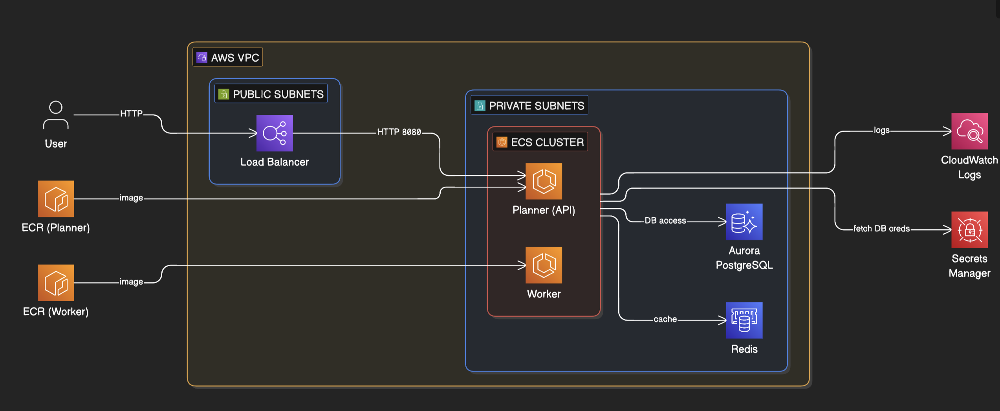

# Agentic AI System with Redis STM & Aurora pgvector LTM

A production-ready **multi-agent AI system** deployed on **AWS ECS Fargate** with hybrid memory architecture:
- **Short-Term Memory (STM)**: ElastiCache Redis for fast task queuing and scratchpad operations
- **Long-Term Memory (LTM)**: Aurora PostgreSQL Serverless v2 with pgvector for semantic retrieval

## 🎯 Overview

This project demonstrates a scalable agentic AI architecture with two specialized agents:

### **Planner Agent** (FastAPI Service)
- Accepts high-level goals from users
- Generates execution plans (decomposed into steps)
- Stores durable run/step records in Aurora PostgreSQL
- Enqueues step tasks to Redis for asynchronous processing
- Provides semantic search over historical executions
- Exposed via Application Load Balancer (ALB)

### **Worker Agent** (Background Service)
- Consumes tasks from Redis queue
- Executes individual steps with autonomy
- Updates step status and results in Aurora
- Stores execution results as semantic memories in pgvector
- Enables intelligent retrieval of past knowledge

## 🏗️ Architecture



The system follows a microservices architecture deployed on AWS:

**Data Flow:**
1. **User** → HTTP requests to Application Load Balancer
2. **Load Balancer** → Routes traffic to Planner Agent (port 8080)
3. **ECR** → Provides Docker images for both Planner and Worker containers
4. **Planner Agent** → Creates plans, stores in Aurora, queues tasks to Redis
5. **Worker Agent** → Consumes tasks from Redis, executes steps, updates Aurora
6. **Aurora PostgreSQL** → Stores durable state and semantic memories (pgvector)
7. **Redis** → Handles task queue and scratchpad memory (STM)
8. **Secrets Manager** → Securely provides DB credentials to ECS tasks
9. **CloudWatch Logs** → Centralized logging for all services

**Network Security:**
- **Public Subnets**: Load Balancer only (internet-facing)
- **Private Subnets**: All ECS tasks, Aurora, Redis (isolated)
- **NAT Gateway**: Enables private subnet outbound access (ECR, Secrets Manager, CloudWatch)
- **Security Groups**: Restrict traffic between components

### Memory Architecture

| Layer | Technology | Purpose | Data Types |
|-------|-----------|---------|-----------|
| **STM** | ElastiCache Redis | Task queue, scratchpad, temporary state | Task metadata, recent context |
| **LTM** | Aurora PostgreSQL + pgvector | Durable storage, semantic retrieval | Run history, step results, embeddings |

### Database Schema

**Aurora PostgreSQL Tables:**
- `agent_runs`: Execution metadata (run_id, goal, created_at)
- `agent_steps`: Step tracking (run_id, step_num, status, result)
- `semantic_memories`: Vector embeddings (pgvector) for semantic search

## 🚀 Tech Stack

- **Container Orchestration**: AWS ECS Fargate
- **API Framework**: FastAPI (Python 3.11+)
- **Message Queue**: ElastiCache Redis (cache.t4g.micro)
- **Vector Database**: Aurora PostgreSQL Serverless v2 (16.6) with pgvector
- **LLM Integration**: AWS Bedrock (with IAM permissions configured)
- **Infrastructure as Code**: Terraform
- **Containerization**: Docker

## 📦 Project Structure

```
agenticai-redis-auroro/
├── assets/
│   └── images/               # Documentation images
│       └── arch-image.png    # AWS architecture diagram
├── agentic-code/
│   ├── services/
│   │   ├── common/           # Shared modules
│   │   │   ├── db.py         # Aurora database operations
│   │   │   ├── embeddings.py # Text embedding (demo impl)
│   │   │   ├── memory.py     # Redis STM interface
│   │   │   ├── models.py     # Pydantic data models
│   │   │   └── vector_store.py # pgvector operations
│   │   ├── planner/          # Planner Agent
│   │   │   ├── Dockerfile
│   │   │   ├── main.py       # FastAPI endpoints
│   │   │   └── requirements.txt
│   │   └── worker/           # Worker Agent
│   │       ├── Dockerfile
│   │       ├── main.py       # Task processor
│   │       └── requirements.txt
│   ├── terraform/            # Infrastructure
│   │   ├── main.tf           # VPC, ECS, Redis, Aurora, Secrets Manager
│   │   ├── outputs.tf        # URLs, endpoints
│   │   ├── variables.tf      # Configuration
│   │   └── terraform.tfvars.example  # Template for credentials
│   └── README.md
├── .gitignore                # Excludes secrets and temp files
└── README.md
```

## 🛠️ Setup & Deployment

### Prerequisites

- AWS CLI configured with appropriate credentials
- Terraform >= 1.0
- Docker
- jq (for JSON parsing in examples)

### Step 1: Configure Database Credentials

Create a `terraform.tfvars` file with your database credentials:

```bash
cd agentic-code/terraform
cp terraform.tfvars.example terraform.tfvars
```

Edit `terraform.tfvars` and set secure credentials:

```hcl
# Required: Database credentials
db_username = "appuser"
db_password = "YourSecurePassword123!"  # Must be at least 8 characters
db_name     = "agentic"

# Optional: Customize other settings
aws_region  = "us-west-2"
project_name = "agentic-sample"
```

⚠️ **IMPORTANT**: The `terraform.tfvars` file is gitignored and should NEVER be committed to version control.

### Step 2: Provision Infrastructure

```bash
terraform init
terraform apply
```

Review the plan and type `yes` to proceed.

This creates:
- **AWS Secrets Manager secret** with your database credentials
- VPC with public/private subnets across 2 AZs
- ElastiCache Redis cluster
- Aurora PostgreSQL Serverless v2 cluster with pgvector
- ECS Fargate cluster with task definitions
- Application Load Balancer
- ECR repositories
- Security groups and IAM roles with:
  - Secrets Manager read access
  - Bedrock model invocation permissions
  - CloudWatch Logs write access

### Step 3: Build & Push Docker Images

Get infrastructure details from Terraform outputs:

```bash
# ECR repositories for Docker images
terraform output ecr_planner_repo
terraform output ecr_worker_repo

# Database secret information
terraform output db_secret_arn
terraform output db_secret_name

# Service endpoints
terraform output planner_url
terraform output redis_endpoint
terraform output aurora_endpoint
```

Authenticate Docker to ECR:

```bash
aws ecr get-login-password --region us-west-2 | \
  docker login --username AWS --password-stdin <ACCOUNT_ID>.dkr.ecr.us-west-2.amazonaws.com
```

Build and push images:

```bash
# From repository root
cd /Users/narayas/Documents/DES\ Project\ Sathya/agenticai-redis-auroro

# Set repository URLs
PLANNER_REPO=$(cd agentic-code/terraform && terraform output -raw ecr_planner_repo)
WORKER_REPO=$(cd agentic-code/terraform && terraform output -raw ecr_worker_repo)

# Build and push Planner Agent
docker build -t ${PLANNER_REPO}:latest -f agentic-code/services/planner/Dockerfile ./agentic-code
docker push ${PLANNER_REPO}:latest

# Build and push Worker Agent
docker build -t ${WORKER_REPO}:latest -f agentic-code/services/worker/Dockerfile ./agentic-code
docker push ${WORKER_REPO}:latest
```

### Step 4: Deploy Services

Update ECS services to use the new images (automatic if using `:latest` tag):

```bash
aws ecs update-service --cluster agentic-sample-cluster \
  --service planner-service --force-new-deployment --region us-west-2

aws ecs update-service --cluster agentic-sample-cluster \
  --service worker-service --force-new-deployment --region us-west-2
```

## 📡 API Usage

### Get the Planner URL

```bash
cd agentic-code/terraform
terraform output planner_url
```

### Start a New Run

```bash
curl -X POST "http://<planner_url>/runs" \
  -H 'Content-Type: application/json' \
  -d '{
    "goal": "Create a comprehensive 3-bullet release note for Q1 features"
  }' | jq
```

**Response:**
```json
{
  "run_id": "a1b2c3d4-e5f6-7890-abcd-ef1234567890",
  "steps": [
    "Clarify the objective: Create a comprehensive 3-bullet release note for Q1 features",
    "Draft a short execution checklist",
    "Produce a final response payload"
  ]
}
```

### Check Run Status

```bash
curl "http://<planner_url>/runs/<run_id>" | jq
```

**Response:**
```json
{
  "run_id": "a1b2c3d4-e5f6-7890-abcd-ef1234567890",
  "goal": "Create a comprehensive 3-bullet release note for Q1 features",
  "steps": [
    {
      "step_num": 1,
      "step_text": "Clarify the objective: ...",
      "status": "done",
      "result": "Objective clarified into: scope, constraints, expected output.",
      "created_at": "2026-01-18T10:30:00Z",
      "updated_at": "2026-01-18T10:30:05Z"
    },
    ...
  ]
}
```

### Semantic Search (pgvector)

Search across all runs:

```bash
curl "http://<planner_url>/search?q=checklist&top_k=5" | jq
```

Search within a specific run:

```bash
curl "http://<planner_url>/search?q=objective&run_id=<run_id>&top_k=5" | jq
```

**Response:**
```json
{
  "query": "checklist",
  "top_k": 5,
  "run_id": null,
  "hits": [
    {
      "id": 123,
      "run_id": "...",
      "source": "worker",
      "content": "- Gather inputs\n- Generate draft\n- Validate\n- Persist output",
      "metadata": {"step_num": 2, "kind": "step_result"},
      "distance": 0.234,
      "created_at": "2026-01-18T10:30:10Z"
    },
    ...
  ]
}
```

### Health Check

```bash
curl "http://<planner_url>/health" | jq
```

## 🔧 Configuration

### Database Credentials (Secrets Manager)

Database credentials are securely managed via AWS Secrets Manager:

**Initial Setup** (via `terraform.tfvars`):
- `db_username`: Aurora master username
- `db_password`: Aurora master password (min 8 chars, validated)
- `db_name`: Database name

**Runtime Access**:
- ECS tasks automatically retrieve credentials from Secrets Manager
- IAM roles enforce least-privilege access
- Credentials are injected as environment variables at task startup

**View/Update Secrets** (after deployment):
```bash
# View secret metadata
aws secretsmanager describe-secret --secret-id agentic-sample-db-credentials

# Retrieve secret value (requires permissions)
aws secretsmanager get-secret-value --secret-id agentic-sample-db-credentials | jq -r .SecretString

# Update password
aws secretsmanager update-secret \
  --secret-id agentic-sample-db-credentials \
  --secret-string '{"username":"appuser","password":"NewSecurePassword456!","dbname":"agentic"}'
```

**After updating secrets**, restart ECS services to pick up new values:
```bash
aws ecs update-service --cluster agentic-sample-cluster \
  --service agentic-sample-planner-svc --force-new-deployment

aws ecs update-service --cluster agentic-sample-cluster \
  --service agentic-sample-worker-svc --force-new-deployment
```

### Environment Variables

**Planner & Worker Agents receive:**
- `REDIS_HOST`: ElastiCache endpoint (auto-injected by Terraform)
- `REDIS_PORT`: Redis port (6379)
- `AURORA_HOST`: Aurora writer endpoint (auto-injected by Terraform)
- `AURORA_PORT`: PostgreSQL port (5432)
- `AURORA_DB`: Database name (from Secrets Manager)
- `AURORA_USER`: Database username (from Secrets Manager)
- `AURORA_PASSWORD`: Database password (from Secrets Manager)
- `QUEUE_KEY`: Redis queue key (agent:queue)
- `EMBED_DIM`: Embedding dimension (384)

**Worker Agent only:**
- `POLL_SECONDS`: Task polling interval (default: 2)

### Terraform Variables

Create `terraform.tfvars` (from `terraform.tfvars.example`):

```hcl
# Required
db_username = "appuser"
db_password = "YourSecurePassword123!"
db_name     = "agentic"

# Optional (with defaults)
aws_region            = "us-west-2"
project_name          = "agentic-sample"
redis_node_type       = "cache.t4g.micro"
aurora_engine_version = "16.6"
aurora_min_acu        = 0.5
aurora_max_acu        = 2
```

### AWS Bedrock Integration

The ECS task role includes permissions to invoke AWS Bedrock models. Both Planner and Worker agents can use Bedrock for:
- Text generation (planning, reasoning)
- Embeddings (replacing demo embeddings)
- Model invocation with response streaming

**Supported Bedrock Actions:**
- `bedrock:InvokeModel` - Synchronous model invocation
- `bedrock:InvokeModelWithResponseStream` - Streaming responses
- `bedrock:ListFoundationalModels` - Discover available models
- `bedrock:GetModel` - Retrieve model metadata

**Example Usage (Python):**
```python
import boto3

bedrock = boto3.client('bedrock-runtime', region_name='us-west-2')

# Invoke Claude 3 Sonnet
response = bedrock.invoke_model(
    modelId='anthropic.claude-3-sonnet-20240229-v1:0',
    body=json.dumps({
        "anthropic_version": "bedrock-2023-05-31",
        "max_tokens": 1024,
        "messages": [{"role": "user", "content": "Explain this plan..."}]
    })
)
```

**Cost Considerations:**
- Bedrock charges per token (input/output)
- Claude 3 Sonnet: ~$3 per 1M input tokens, ~$15 per 1M output tokens
- Enable CloudWatch metrics to monitor usage

## 🔒 Security Considerations

### Current Implementation

✅ **Secure Credential Management**:
- Database credentials are stored in **AWS Secrets Manager**
- ECS tasks retrieve credentials securely at runtime via IAM roles
- Credentials are never exposed in Terraform state or environment variables
- `terraform.tfvars` is gitignored to prevent accidental commits

✅ **IAM Security**:
- Task execution role has limited permissions to read secrets
- Task role has permissions for Bedrock model invocation
- Services run in private subnets with NAT gateway for outbound access
- Security groups restrict network access to required ports only

### Production Enhancements

While the current setup follows security best practices, consider these additional hardening measures for production:

1. **Enable Secret Rotation**:
   ```bash
   aws secretsmanager rotate-secret \
     --secret-id agentic-sample-db-credentials \
     --rotation-lambda-arn <rotation-lambda-arn>
   ```

2. **Enable VPC Endpoints**: Add VPC endpoints for ECR, Secrets Manager, CloudWatch to avoid internet traffic:
   ```hcl
   # In terraform/main.tf
   resource "aws_vpc_endpoint" "secretsmanager" {
     vpc_id            = aws_vpc.this.id
     service_name      = "com.amazonaws.${var.aws_region}.secretsmanager"
     vpc_endpoint_type = "Interface"
     subnet_ids        = [aws_subnet.private_a.id, aws_subnet.private_b.id]
     security_group_ids = [aws_security_group.vpc_endpoints.id]
   }
   ```

3. **Enable Aurora Encryption**: Add KMS encryption for data-at-rest:
   ```hcl
   resource "aws_rds_cluster" "aurora" {
     # ... existing config ...
     storage_encrypted = true
     kms_key_id       = aws_kms_key.aurora.arn
   }
   ```

4. **Enable CloudTrail**: Monitor Secrets Manager access:
   ```bash
   aws cloudtrail lookup-events \
     --lookup-attributes AttributeKey=ResourceName,AttributeValue=agentic-sample-db-credentials
   ```

5. **Enable WAF**: Add AWS WAF rules to ALB for protection against common attacks
6. **Implement Network ACLs**: Add network ACLs for defense in depth
7. **Enable GuardDuty**: Monitor for suspicious activity across your AWS account
8. **Audit IAM Policies**: Regularly review and tighten IAM permissions

## 📊 Monitoring & Logging

### CloudWatch Logs
- Log Group: `/ecs/agentic-sample-planner`
- Log Group: `/ecs/agentic-sample-worker`

### Metrics to Monitor
- **ECS**: CPU/Memory utilization, task count
- **Redis**: Cache hit rate, evictions, connections
- **Aurora**: Query latency, connections, storage
- **ALB**: Request count, latency, error rates

### View Logs

```bash
aws logs tail /ecs/agentic-sample-planner --follow --region us-west-2
aws logs tail /ecs/agentic-sample-worker --follow --region us-west-2
```

## 🚧 Current Limitations & Future Enhancements

### Current Limitations

1. **Demo Embeddings**: Uses deterministic hash-based embeddings
   - Replace `services/common/embeddings.py` with real embedding service:
     - AWS Bedrock Titan Embeddings
     - OpenAI Embeddings API
     - Cohere Embeddings
     - Sentence Transformers (self-hosted)

2. **Simple Planning**: Hardcoded 3-step plans
   - Integrate LLM-based planning (Bedrock is IAM-ready, needs implementation)
   - Implement LangGraph for complex workflows
   - Add dynamic plan adjustment based on execution feedback

3. **Basic Step Execution**: Stub implementation
   - Add tool use capabilities (web search, API calls, data processing)
   - Implement reasoning loops (ReAct, Chain-of-Thought)
   - Add human-in-the-loop approval gates

### Planned Enhancements

- [✅] **Bedrock IAM Permissions**: Already configured for model invocation
- [ ] Replace demo embeddings with Bedrock Titan Embeddings
- [ ] Integrate LLM for intelligent planning (Claude 3 Sonnet via Bedrock)
- [ ] Add vector index optimization (HNSW vs IVFFlat)
- [ ] Implement step retry logic with exponential backoff
- [ ] Add WebSocket support for real-time updates
- [ ] Create admin dashboard (React + Vite)
- [ ] Add authentication/authorization (Cognito)
- [ ] Implement cost tracking and budget alerts (including Bedrock usage)
- [ ] Add distributed tracing (X-Ray)
- [ ] Support multi-tenancy

## 🧪 Testing

### Local Development

```bash
# Start local Redis
docker run -d -p 6379:6379 redis:7-alpine

# Start local PostgreSQL with pgvector
docker run -d -p 5432:5432 \
  -e POSTGRES_PASSWORD=postgres \
  -e POSTGRES_DB=agentic \
  pgvector/pgvector:pg16

# Install dependencies
cd agentic-code/services/planner
pip install -r requirements.txt

# Set environment variables
export REDIS_HOST=localhost
export DB_HOST=localhost
export DB_USER=postgres
export DB_PASSWORD=postgres
export DB_NAME=agentic

# Run Planner
uvicorn main:app --reload

# In another terminal, run Worker
cd ../worker
pip install -r requirements.txt
python main.py
```

### Run Tests

```bash
# TODO: Add pytest test suite
pytest tests/ -v --cov=services
```

## 📝 Notes

- **Secrets Management**: Database credentials are stored in AWS Secrets Manager and never exposed in Terraform state, logs, or environment variable listings. The Terraform state only contains the secret ARN, not the actual credentials.

- **pgvector Index Type**: If your Aurora version doesn't support HNSW indexing, modify `services/common/db.py` to use `ivfflat`:
  ```sql
  CREATE INDEX IF NOT EXISTS semantic_memories_embedding_idx 
  ON semantic_memories USING ivfflat(embedding vector_cosine_ops);
  ```

- **Cost Optimization**: Aurora Serverless v2 scales down to 0.5 ACU when idle. Consider pausing non-production clusters or using Aurora Serverless v1 with auto-pause for development environments.

- **Scaling**: Adjust ECS task count in `terraform/main.tf` based on workload:
  ```hcl
  desired_count = 2  # Increase for higher throughput
  ```

- **Credential Rotation**: To rotate database credentials, update the secret in Secrets Manager, then update the Aurora master password separately:
  ```bash
  # Update Aurora password to match new secret
  aws rds modify-db-cluster --db-cluster-identifier agentic-sample-aurora \
    --master-user-password "NewPassword" --apply-immediately
  ```

## 🤝 Contributing

1. Fork the repository
2. Create a feature branch (`git checkout -b feature/amazing-feature`)
3. Commit changes (`git commit -m 'Add amazing feature'`)
4. Push to branch (`git push origin feature/amazing-feature`)
5. Open a Pull Request

## 📄 License

This project is provided as-is for demonstration purposes.

## 📧 Support

For issues or questions, please open a GitHub issue or contact the maintainer.

---

**Built with ❤️ using AWS, FastAPI, Redis, and PostgreSQL pgvector**
